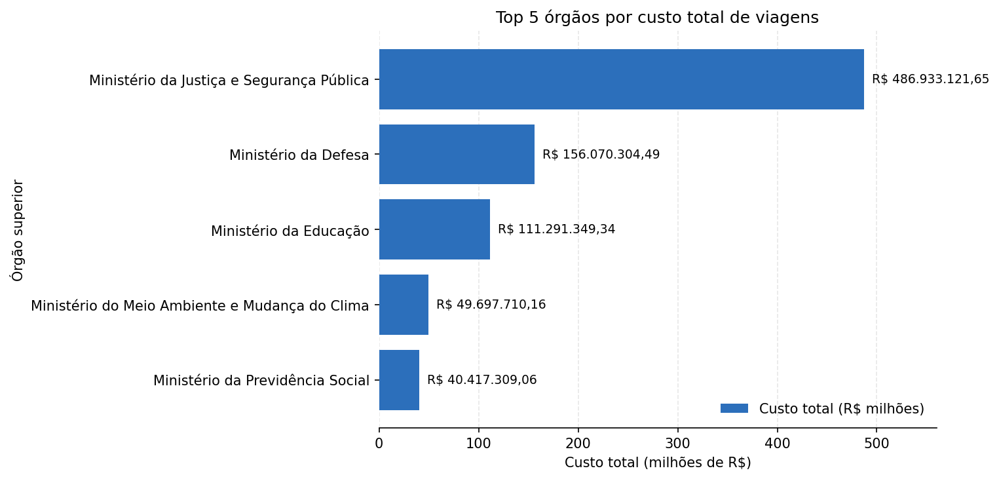
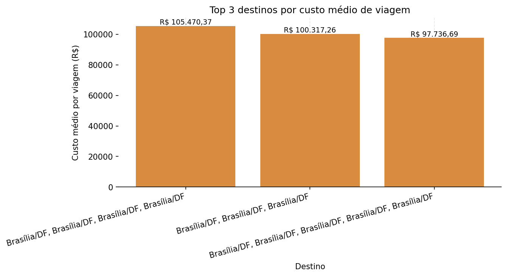
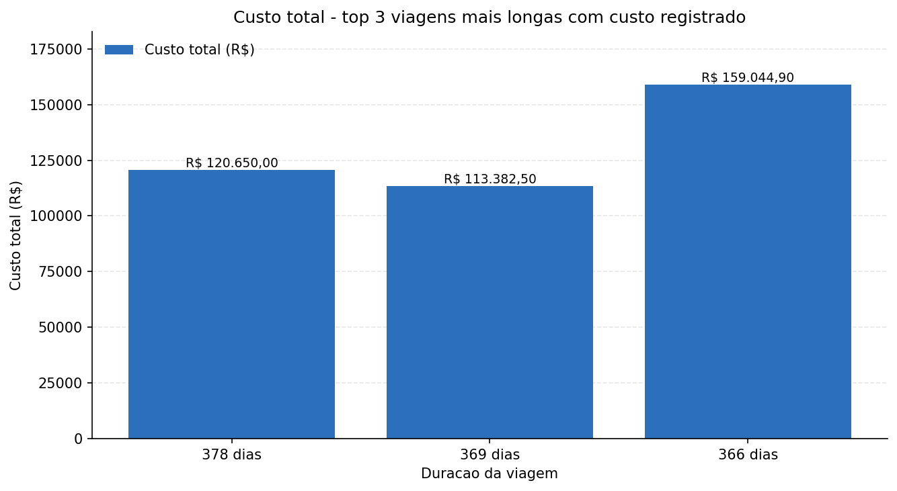
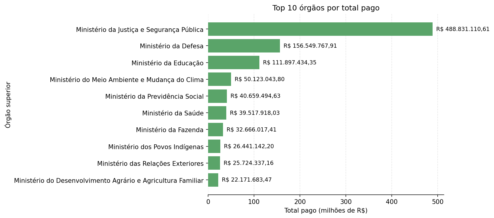
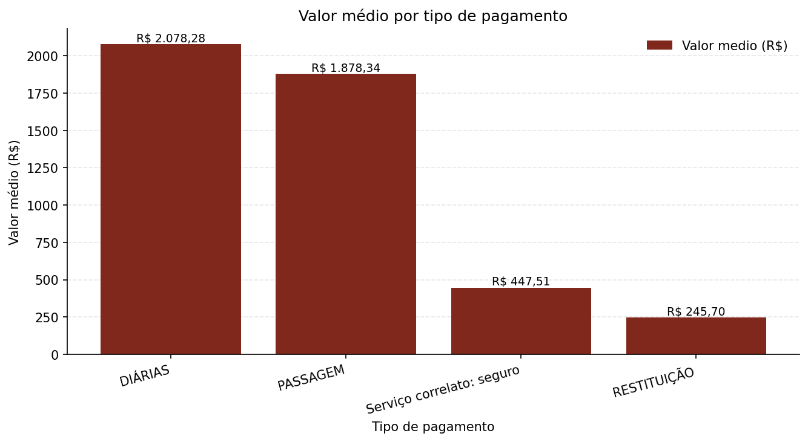
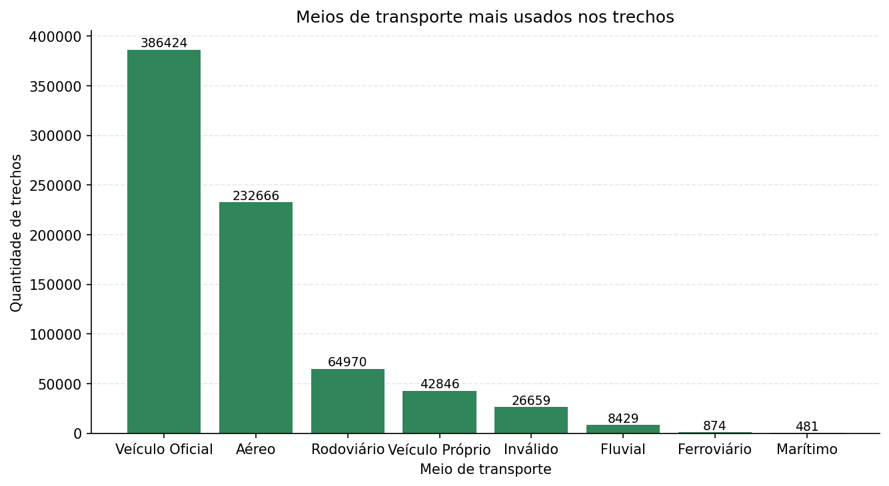
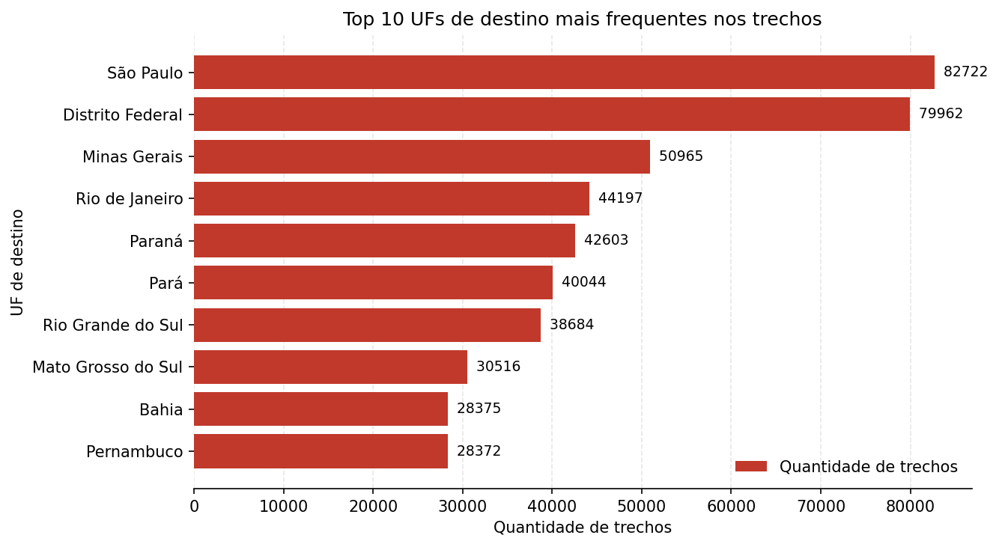

# Pipeline ETL - Viagens a Servico (Portal da Transparencia)

## O problema

O Portal da Transparência do Governo Federal publica os dados de
"Viagens a Serviço", mas em formato bruto: texto solto, datas em
DD/MM/AAAA, valores com vírgula decimal e sem relacionamento
entre as tabelas. Um órgão público que precise avaliar seus gastos com
viagens, como quanto gastou, com quem, para onde, de que forma, não
consegue responder isso diretamente a partir do CSV original.

Este projeto resolve esse problema construindo um pipeline de dados
completo, desde o download automatizado até a elaboração de métricas
e gráficos. Os dados correspondem a um recorte de 6 meses (jan-jun/2025).

## Tecnologias utilizadas

- **Python 3.10** - orquestração do pipeline, com as bibliotecas `pandas`, `gdown` para baixar o dataset do Google Drive e
  `mysql-connector-python` para a conexão com o banco.
- **MySQL 8** - armazenamento das 3 camadas (Raw, Silver, Gold), com
  chaves primarias/estrangeiras e constraints declaradas em SQL puro.
- **Jupyter Notebook** + **matplotlib** - camada de analise (Fase 3):
  consultas SQL, tabelas e gráficos das perguntas de negócio.
- **Arquitetura Medallion** (Raw -> Silver -> Gold) como modelo de
  organização das camadas de dados, isolando dado bruto, dado limpo e
  métrica de negócio em estágios distintos.

## Arquitetura

- **Raw**: dados brutos dos CSVs, carregados como texto.
- **Silver**: dados limpos e tipados (datas, valores em decimal, nulos
  tratados), com PK/FK/CHECK/UNIQUE/NOT NULL.
- **Gold**: agregações de negócio (JOIN + GROUP BY sobre a Silver),
  como tabela e como view.

## Estrutura do projeto

Os arquivos são organizados por **tipo**, não pela ordem do pipeline:

```
scripts/                     -> todos os .py do projeto
  config.py                    caminhos, credenciais (via .env)
  banco.py                     conexão MySQL
  1_extrair.py                 Fase 1: baixa o .zip, extrai os CSVs, carrega a Raw
  2_transformar.py             Fase 2: Raw -> Silver (tipagem, limpeza, cálculos)
sql/
  0_criar_banco.sql            Fase 0: DDL das 8 tabelas (Raw + Silver)
notebooks/
  3_analise.ipynb              Fase 3: camada Gold, perguntas de negócio + gráficos
data/                         -> .zip e .csv baixados (gitignored, gerado pela Fase 1)
outputs/                      -> gráficos exportados em PNG pelo notebook
```

A **ordem de execucao segue a nomenclatura dos arquivos: 0 -> 1 -> 2 -> 3**, mesmo os
arquivos estando em pastas diferentes (agrupados por tipo: `.sql`,
`.py`, `.ipynb`).

O notebook (`notebooks/3_analise.ipynb`) fica em uma pasta separada
dos `.py` (arquivos de tipos diferentes) e usa
`sys.path.append('../scripts')` na primeira célula de código para
conseguir importar `banco.py`/`config.py` de dentro de `notebooks/`.

## Pre-requisitos

- Python 3.10+
- MySQL 8
- Pacotes Python: ver `requirements.txt`

## Como rodar do zero

1. Crie e ative um ambiente virtual, depois instale as dependências:

   ```
   python3 -m venv venv
   source venv/bin/activate
   pip install -r requirements.txt
   ```

2. Copie `.env.example` para `.env` e preencha com as credenciais do
   seu MySQL local:

   ```
   cp .env.example .env
   ```

3. Crie o banco e as tabelas (Raw + Silver):

   ```
   sql/0_criar_banco.sql
   ```

4. Rode o pipeline, na ordem, a partir da raiz do projeto:

   ```
   python3 scripts/1_extrair.py
   python3 scripts/2_transformar.py
   ```

5. Abra `notebooks/3_analise.ipynb` e rode todas as células (cria a
   camada Gold e gera as respostas + gráficos das perguntas de negócio).
   Cada gráfico também e exportado como PNG em `outputs/`.

## Principais insights (Fase 3 - Gold)

Resultados obtidos rodando o pipeline completo sobre o recorte de 6 meses
(jan-jun/2025).

### 1. Órgãos com maior custo total



O Ministério da Justiça e Segurança Pública lidera com folga: R$ 486,9
milhões, mais de 3x o segundo colocado (Ministério da Defesa, R$ 156,1
milhões). Os dois juntos já superam a soma dos outros três do top 5.

### 2. Destinos com maior custo medio por viagem



Com o filtro de pelo menos 30 viagens no grupo, os 3 primeiros colocados
são todos strings repetidas de "Brasília/DF" (viagens com vários trechos
dentro da propria capital), custando entre R$ 97,7 mil e R$ 105,5 mil em
media - bem acima da media geral de uma viagem no dataset.

### 3. Viagem de maior duração



A viagem mais longa do recorte tem 383 dias (Ministerio da Previdência
Social) mas custo R$ 0,00 registrado até o momento - uma possibilidade
é que os custos ainda não foram lançados no período de 6 meses do recorte
dos dados. Como essa viagem não tem custo para
exibir em num gráfico, foi feito o estudo das 3 viagens de maior duração que
possuem `valor_total > 0` (378, 369 e 366 dias) - todas acima de R$ 100 mil,
mostrando que viagens de longa duração tendem a custar
acima de seis dígitos quando o custo já foi lançado.

### 4. Órgão que mais pagou no total (camada Gold)



Mesmo órgão no ranking da Pergunta 1 (Ministério da Justiça e Segurança
Pública), agora somando os pagamentos individuais: R$ 488,8 milhões em
175.814 pagamentos. O valor bate de perto com o `valor_total` agregado
por viagem (R$ 486,9 milhões), o que é um bom sinal de consistência
entre as duas formas de calcular custo (por viagem vs por pagamento).

### 5. Tipo de pagamento com maior valor medio



DIÁRIAS tem o maior valor medio por pagamento (R$ 2.078,28), superando
PASSAGEM (R$ 1.878,34) - possivelmente porque cada lançamento de DIÁRIA cobre vários dias de viagem em uma única transação, diferente da PASSAGEM que é um único valor por bilhete. RESTITUIÇÃO é o menor valor médio (R$ 245,70).

### 6. Meio de transporte mais usado nos trechos



Veículo Oficial domina (386.424 trechos, mais da metade do total), à frente de
Aéreo (232.666). Isso demonstra que a maior parte dos deslocamentos em viagens a
serviço é terrestre e institucional.

### 7. UF de destino mais frequente nos trechos



São Paulo aparece em mais trechos (82.722) do que o Distrito Federal
(79.962) - por pouco, ambos bem a frente do terceiro colocado (Minas
Gerais, 50.965).

## Decisões de modelagem (Fase 2 - Silver)

- `valor_total` = diarias + passagens + outros_gastos - devolucao (líquido).
- `duracao_dias` = `DATEDIFF(data_fim, data_inicio)`.

## Melhorias futuras

- Separar a coluna `destinos` de `silver_viagem` (texto livre, vários
  destinos numa única string) em uma tabela `silver_viagem_destino`
  (uma linha por destino), permitindo agregações mais limpas do que a
  atual (que agrupa pela string inteira).
